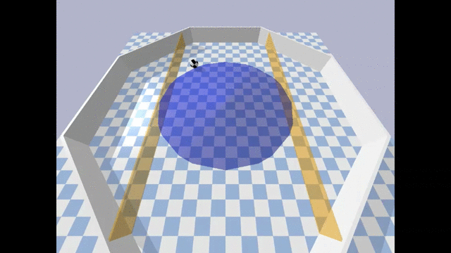
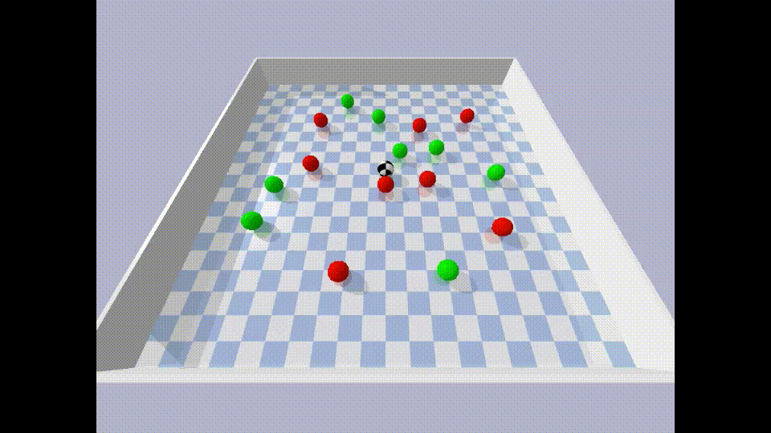
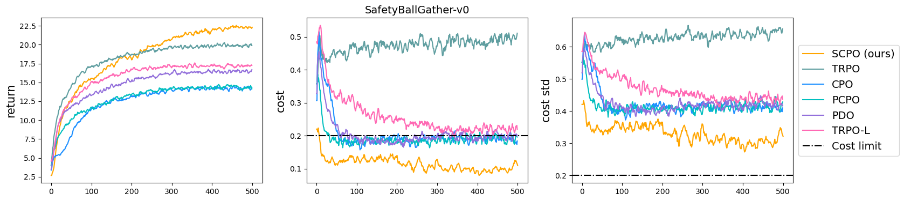
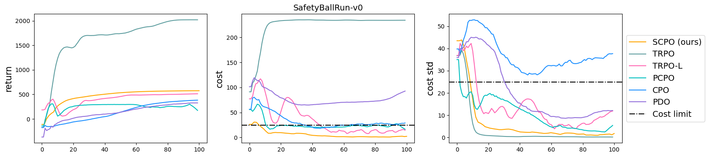
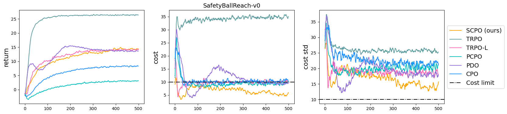
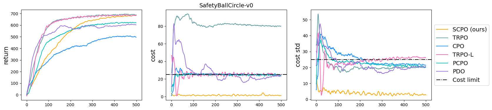
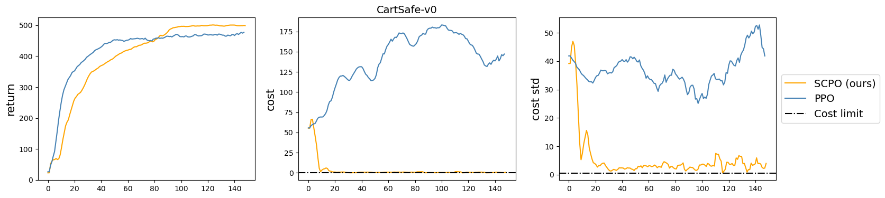

## Safty Critic Policy Interation (SCPO)
SCPO is a safe reinforcement learning algorithm. This repo is a fork of [Stable Baselines3](https://github.com/DLR-RM/stable-baselines3).


## Installation
**Note:** Stable-Baselines3 supports PyTorch >= 1.11
### Prerequisites
SCPO requires Python 3.7+.
### Install using pip
Install the Stable Baselines3 package:
```
pip install -r requirements.txt
```
We use environments from Bullet-Safety-Gym. Please follow the installation steps from https://github.com/SvenGronauer/Bullet-Safety-Gym.

If you want to run pytorch in gpu mode, please install cuda and pytorch separately https://pytorch.org/
## Training
Example code for training can be found at [train.py](./train.py). To train models with the best hyperparameters, please check [train_best_hyper.py](./train_best_hyper.py).
## Running the environment
Check [play.py](./play.py).


|||
|---|---|
|||

## Benchmark
 &nbsp;&nbsp;
 &nbsp;&nbsp;
 &nbsp;&nbsp;
 &nbsp;&nbsp;
 &nbsp;&nbsp;


## Citation
If you find the repository useful, please cite the study
``` Bash
@article{mhamed2023scpo,
  title={SCPO: Safe Reinforcement Learning with Safety Critic Policy Optimization},
  author={Mhamed, Jaafar and Gu, Shangding},
  journal={arXiv preprint arXiv:2311.00880},
  year={2023}
}

```
